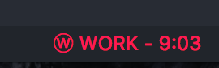

# vscode-mpanjifa-votabia

VSCode client for pomodoro server [votabia](https://github.com/tagip/votabia).

## Features

Displays the pomodoro status on the status bar :

## Extension Settings

This extension contributes the following settings:

* `mpanjifaVotabia.votabiaServerURL`: the votabia server URL
